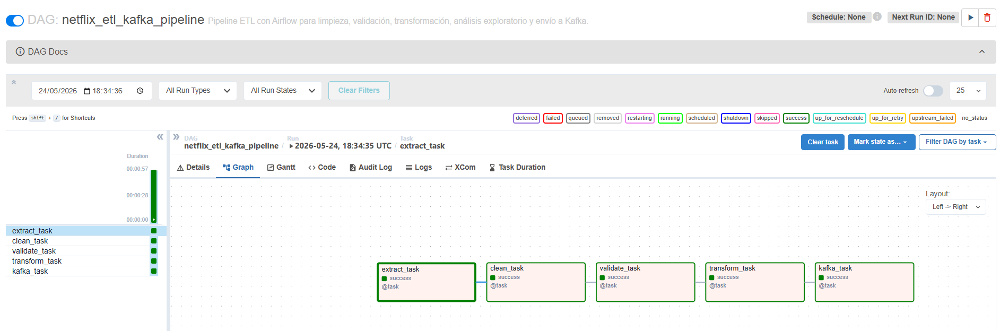

# Proyecto SDPD - Pipeline ETL con Airflow y Kafka

## Descripción

Este proyecto implementa un pipeline ETL utilizando Apache Airflow y Apache Kafka para el procesamiento distribuido de datos.

El sistema procesa un dataset de contenidos de Netflix aplicando distintas fases de extracción, limpieza, validación, transformación y carga de datos mediante un DAG desarrollado con TaskFlow API.

La solución se ejecuta mediante contenedores Docker y genera resultados procesados en formato Parquet junto con análisis exploratorio de datos.

---

## Tecnologías utilizadas

- Python 3.12
- Apache Airflow 2.9.1
- Apache Kafka
- PostgreSQL
- Docker
- Pandas
- PyArrow
- Matplotlib
- TOML

---

## Estructura del proyecto

```text
sdpd-airflow-project/
│
├── dags/
│   └── data_pipeline_dag.py
│
├── tasks/
│   ├── extract.py
│   ├── clean.py
│   ├── validate.py
│   ├── transform.py
│   ├── kafka_loader.py
│   └── eda.py
│
├── data/
│   ├── raw/
│   │   └── netflix_titles.csv
│   ├── processed/
│   │   └── netflix_cleaned.parquet
│   └── reports/
│       ├── eda_summary.csv
│       └── plots/
│           ├── content_distribution.png
│           └── release_year_distribution.png
│
├── Dockerfile
├── docker-compose.yml
├── config.toml
├── requirements.txt
├── README.md
├── informe.md
└── grafo_pipeline.png
```

---

## Flujo ETL implementado

El DAG contiene cinco tareas principales:

1. `extract_task`
2. `clean_task`
3. `validate_task`
4. `transform_task`
5. `kafka_task`

La secuencia de ejecución sigue un patrón ETL claro: primero se extraen y preparan los datos, después se validan y transforman, y finalmente se cargan en Kafka.

---

## Fases del pipeline

### 1. Extracción

Se carga el dataset original en formato CSV y se comprueba que el fichero existe y contiene registros.

### 2. Limpieza

Durante esta fase se realizan las siguientes operaciones:

- normalización de nombres de columnas
- eliminación de duplicados
- eliminación de registros sin título
- tratamiento de valores nulos en columnas textuales
- conversión de fechas

### 3. Validación

Se aplican reglas básicas de calidad:

- comprobación de columnas obligatorias
- validación de títulos no nulos
- comprobación de rangos de años

### 4. Transformación

Se generan nuevas variables derivadas:

- antigüedad del contenido
- longitud del título
- número de categorías
- variable binaria para identificar películas

También se genera un resumen estadístico en CSV y gráficos básicos de análisis exploratorio.

### 5. Carga en Kafka

Los registros procesados se serializan como JSON y se publican en un topic de Apache Kafka para dejarlos preparados para fases posteriores.

---

## Configuración externa

La configuración del pipeline se almacena en el archivo:

```text
config.toml
```

Este fichero contiene rutas de entrada y salida, parámetros del pipeline y configuración de Kafka.

---

## Ejecución del proyecto

Para levantar el entorno completo:

```bash
docker compose up -d --build
```

Acceso a la interfaz web de Airflow:

```text
http://localhost:8080
```

Credenciales por defecto:

```text
usuario: admin
contraseña: admin
```

---

## Resultados generados

Tras ejecutar correctamente el DAG se generan:

- dataset procesado en formato Parquet
- resumen EDA en CSV
- gráficos EDA en formato PNG
- mensajes publicados en Kafka
- grafo del DAG ejecutado correctamente en Airflow

---

## Grafo del DAG



---

## Gráficos EDA

### Distribución de contenido


### Distribución de años de lanzamiento

