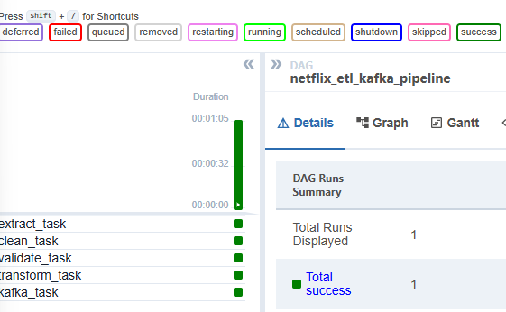

# Informe técnico - Proyecto SDPD

## 1. Introducción

El objetivo de esta práctica es desarrollar un pipeline de datos utilizando Apache Airflow y Apache Kafka.

Para ello se ha implementado un flujo ETL sobre un dataset de contenidos de Netflix. El sistema automatiza la extracción, limpieza, validación, transformación y carga de los datos, dejando el resultado preparado para continuar el procesamiento en fases posteriores.

La ejecución del entorno se realiza mediante Docker Compose, lo que permite levantar Airflow, PostgreSQL, Kafka y Zookeeper de forma reproducible.

---

## 2. Dataset utilizado

Se ha utilizado el dataset público “Netflix Movies and TV Shows”.

El conjunto de datos contiene información sobre películas y series disponibles en Netflix. Algunas de sus columnas principales son:

- identificador del contenido
- tipo de contenido
- título
- director
- reparto
- país
- fecha de incorporación
- año de lanzamiento
- clasificación
- duración
- categorías
- descripción

El dataset original se almacena en formato CSV dentro de la carpeta `data/raw`.

---

## 3. Arquitectura del sistema

La arquitectura del proyecto está formada por varios servicios ejecutados mediante contenedores Docker.

### Apache Airflow

Apache Airflow se utiliza como herramienta de orquestación del pipeline.

El DAG se ha implementado mediante TaskFlow API, utilizando decoradores `@dag` y `@task`. Esto permite definir las tareas y sus dependencias de forma clara dentro del código Python.

### PostgreSQL

PostgreSQL se utiliza como base de datos interna de Airflow.

Almacena metadatos del sistema, información de ejecuciones, estados de tareas y configuración interna de Airflow.

### Apache Kafka

Apache Kafka se utiliza como sistema de mensajería distribuida.

Al finalizar el pipeline, una muestra del dataset procesado se envía a un topic de Kafka en formato JSON. De esta forma, los datos quedan disponibles para fases posteriores de procesamiento.

### Docker

Docker Compose permite ejecutar todos los servicios necesarios de forma aislada y reproducible.

---

## 4. Diseño del DAG

El DAG implementado se llama:

```text
netflix_etl_kafka_pipeline
```

Contiene cinco tareas, cumpliendo el rango de 3 a 5 tareas solicitado en el enunciado:

```text
extract_task -> clean_task -> validate_task -> transform_task -> kafka_task
```

Esta secuencia representa un flujo ETL completo.

---

## 5. Tareas del pipeline

### 5.1 Extracción de datos

La tarea `extract_task` lee la ruta del dataset desde `config.toml` y comprueba que el fichero CSV existe y contiene datos.

Esta tarea no modifica todavía el contenido del dataset, ya que su objetivo es únicamente iniciar el flujo con los datos en bruto.

### 5.2 Limpieza de datos

La tarea `clean_task` realiza la preparación inicial del dataset.

Las operaciones principales son:

- normalización de nombres de columnas
- eliminación de registros duplicados
- eliminación de registros sin título
- tratamiento de valores nulos en columnas textuales
- conversión de fechas

El resultado se guarda en formato Parquet para mejorar la eficiencia de lectura y escritura.

### 5.3 Validación de datos

La tarea `validate_task` aplica reglas básicas de calidad.

Se comprueba que existen columnas obligatorias, que no hay títulos nulos después de la limpieza y que los años de lanzamiento se encuentran dentro de un rango razonable.

Si alguna regla no se cumple, el pipeline se detiene para evitar continuar con datos incorrectos.

### 5.4 Transformación y análisis exploratorio

La tarea `transform_task` genera variables derivadas a partir de los datos limpios y validados.

Las nuevas variables generadas son:

- `content_age`: antigüedad del contenido respecto al año 2026
- `title_length`: longitud del título
- `num_categories`: número de categorías asociadas al contenido
- `is_movie`: variable binaria que indica si el contenido es una película

También se genera un resumen EDA en CSV y gráficos básicos en formato PNG.

Los gráficos generados son:

- distribución de películas y series
- distribución de años de lanzamiento

### 5.5 Carga en Kafka

La tarea `kafka_task` envía registros procesados a Apache Kafka.

Los datos se convierten a mensajes JSON y se publican en el topic configurado en `config.toml`.

---

## 6. Configuración externa

Las rutas y parámetros principales del pipeline se almacenan en:

```text
config.toml
```

Este enfoque permite separar la configuración de la lógica del código.

El archivo incluye:

- ruta del dataset original
- ruta del dataset procesado
- ruta de reportes
- servidor de Kafka
- topic de Kafka

---

## 7. Resultados generados

Tras ejecutar el DAG correctamente se generan los siguientes resultados:

```text
data/processed/netflix_cleaned.parquet
data/reports/eda_summary.csv
data/reports/plots/content_distribution.png
data/reports/plots/release_year_distribution.png
```

Además, el DAG publica mensajes en Kafka y se puede comprobar visualmente su ejecución desde la interfaz web de Airflow.

---

## 8. Eficiencia

El proyecto utiliza formato Parquet para almacenar el dataset procesado, ya que se trata de un formato columnar más eficiente que CSV para análisis de datos.

Además, las operaciones de limpieza y transformación se realizan utilizando operaciones vectorizadas de Pandas cuando es posible, reduciendo recorridos innecesarios sobre el dataset.

---

## 9. Captura del grafo del DAG

A continuación se muestra el grafo del DAG en la interfaz web de Airflow:


El grafo muestra cinco tareas conectadas en secuencia lineal:

- **extract_task**: lee el CSV original y comprueba que existe y tiene datos.
- **clean_task**: normaliza columnas, elimina duplicados y guarda en Parquet.
- **validate_task**: comprueba columnas obligatorias y rangos de valores.
- **transform_task**: genera variables derivadas, resumen CSV y gráficos EDA.
- **kafka_task**: serializa los registros como JSON y los publica en Kafka.

La secuencia de ejecución es:

extract_task → clean_task → validate_task → transform_task → kafka_task

A continuación se muestra la ejecución completa del DAG con todas las tareas completadas correctamente:



El panel confirma una ejecución con estado Total success, con las cinco tareas en verde y un tiempo total de ejecución de aproximadamente un minuto.

---

## 10. Conclusiones

El proyecto implementa un pipeline ETL funcional y reproducible utilizando Apache Airflow, Apache Kafka y Docker.

La solución permite procesar un dataset real, aplicar limpieza y validación de datos, generar transformaciones y resultados de análisis exploratorio, y publicar el resultado final en Kafka para continuar con futuras fases del proyecto.